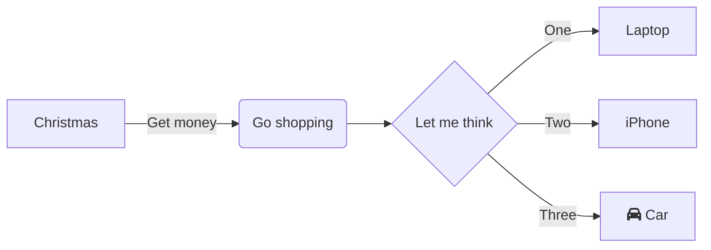

## Usage

Mermaid is a diagramming and charting tool that renders Markdown-inspired text definitions to create
and modify diagrams dynamically.
You can easily see some sample diagrams or create your own through its [Live Editor](https://mermaid-js.github.io/mermaid-live-editor/).

## Example



[Preview graph](https://mermaid-js.github.io/mermaid-live-editor/edit#eyJjb2RlIjoiZ3JhcGggTFJcbiAgICBBW0NocmlzdG1hc10gLS0-fEdldCBtb25leXwgQihHbyBzaG9wcGluZylcbiAgICBCIC0tPiBDe0xldCBtZSB0aGlua31cbiAgICBDIC0tPnxPbmV8IERbTGFwdG9wXVxuICAgIEMgLS0-fFR3b3wgRVtpUGhvbmVdXG4gICAgQyAtLT58VGhyZWV8IEZbZmE6ZmEtY2FyIENhcl0iLCJtZXJtYWlkIjoie1xuICBcInRoZW1lXCI6IFwiYmFzZVwiLFxuICBcInRoZW1lVmFyaWFibGVzXCI6IHtcbiAgICAgICAgXCJkYXJrTW9kZVwiOiB0cnVlLFxuICAgICAgICBcImJhY2tncm91bmRcIjogXCIjMzgzYzRhXCIsXG4gICAgICAgIFwicHJpbWFyeUNvbG9yXCI6IFwiI2M2OFwiXG4gICAgfVxufSIsInVwZGF0ZUVkaXRvciI6ZmFsc2UsImF1dG9TeW5jIjp0cnVlLCJ1cGRhdGVEaWFncmFtIjpmYWxzZX0)

Theme of preview [customized](https://mermaid-js.github.io/mermaid/#/theming?id=theme-variables-reference-table)
to better contrast with this site's background.
At the background option,
choose the expected background color Mermaid must contrast with.

```json
{
  "theme": "base",
  "themeVariables": {
        "darkMode": true,
        "background": "#383c4a",
        "primaryColor": "#c68"
    }
}
```
